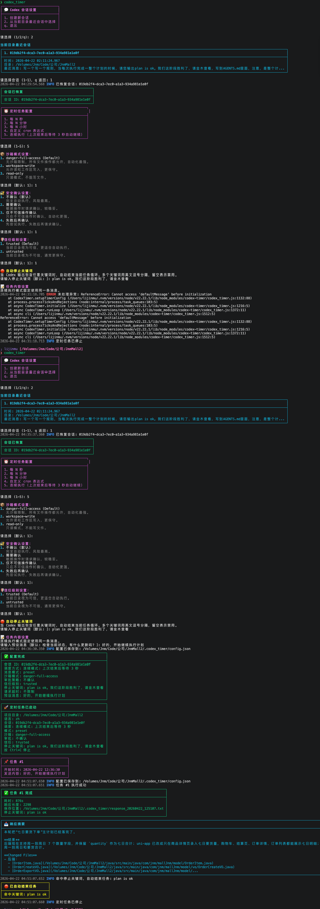

# codex-timer

English documentation: Chinese version is available at [README_ZH.md](./README_ZH.md).

`codex_timer` is a Node.js CLI for running Codex sessions inside the current project directory.

It uses the official `@openai/codex-sdk`, filters sessions by the current working directory, and stores all runtime data in a local `.codex_timer/` folder inside the project.

## Preview



Once installed globally, you can enter any project and run:

```bash
codex_timer
```

The CLI also supports changing the UI language directly:

```bash
codex_timer -lang
```

## What it does

- Create a new Codex session or resume an existing one
- Only list sessions whose recorded `cwd` matches the current directory
- Show the latest user message preview when multiple sessions exist
- Save config, logs, and responses under the current project's `.codex_timer/`
- Support fixed interval mode
- Support simplified cron mode
- Support continuous mode
  starts the next run 3 seconds after the previous one finishes
- Support auto-stop keywords
  automatically stop the current loop when the Codex response contains a matching keyword
- Do not enforce a request timeout by default

## Requirements

Before using `codex_timer`, make sure you have:

- Node.js 18 or newer
- `codex` CLI installed and available in `PATH`
- A working Codex login on the current machine

Quick checks:

```bash
node -v
codex --version
```

If `codex` is not available, install and configure it first.

## Installation

### Install globally

```bash
npm i -g codex-timer
```

## First run tutorial

### Language preference

On the first launch, `codex_timer` asks for your preferred language:

- Chinese
- English

This preference is stored globally in:

```text
~/.codex_timer/preferences.json
```

After that, the same language will be used by default in every project.

If you want to change it later, run:

```bash
codex_timer -lang
```

You can also switch directly with:

```bash
codex_timer -lang en
codex_timer -lang zh
```

### 1. Enter a project directory

```bash
cd /path/to/your-project
```

### 2. Start the tool

```bash
codex_timer
```

### 3. Choose a session

You will see:

- `1. Create a new session`
- `2. Select from recent sessions for this directory`

If the current project already has previous sessions, the tool will show:

- session ID
- timestamp
- directory
- latest user message preview

### 4. Choose a schedule mode

Available modes:

- fixed interval in seconds
- fixed interval in minutes
- fixed interval in hours
- simplified cron
- continuous mode

### 5. Choose how messages are sent

Depending on the mode, you can:

- use a preset message every time
- manually enter the first message and reuse it automatically later
- in continuous mode, always reuse the same preset message

### 6. Configure auto-stop keywords

You can optionally set one or more stop keywords.

When any future Codex response contains one of these keywords, `codex_timer` will automatically stop the current loop.

Examples:

```text
done
finished
任务完成
```

You can enter multiple keywords separated by commas.

If you leave this field empty, the feature stays disabled.

## Runtime files

When you run `codex_timer` inside a project, it creates:

```text
your-project/
  .codex_timer/
    config.json
    logs/
      timer.log
    response_YYYYMMDD_HHMMSS.txt
```

This means every project keeps its own:

- config
- logs
- saved responses

Nothing is mixed across different projects.

Global user preferences such as language are stored separately under:

```text
~/.codex_timer/preferences.json
```

## Modes

### Fixed interval mode

Runs the next task every N seconds, minutes, or hours.

Good for:

- periodic checks
- repeated follow-up prompts
- lightweight automation loops

### Cron mode

Uses a simplified 5-field cron expression.

Examples:

```text
*/30 * * * *
0 */2 * * *
0 9 * * *
```

Good for:

- scheduled daily or hourly tasks
- regular report generation
- predictable automation windows

### Continuous mode

Always uses the same preset message.

After one run finishes, `codex_timer` waits 3 seconds and starts the next run automatically.

Good for:

- long-running autonomous workflows
- repeated pipeline-style prompts
- “keep going until I stop it” loops

### Auto-stop keywords

This is not a separate scheduling mode.

It is an optional stopping condition that works together with the selected mode.

If the Codex output contains any configured stop keyword, the current automation loop ends immediately.

## Session behavior

`codex_timer` only reads local session metadata from:

```text
~/.codex/sessions/
```

But it does not show everything in that folder.

It only keeps sessions where:

```text
session.cwd === current working directory
```

This prevents cross-project session confusion.

## Local development

Install dependencies:

```bash
npm install
```

Run directly:

```bash
node codex_timer.js
```

Run tests:

```bash
npm test
```

## Troubleshooting

### `codex_timer: command not found`

The global npm bin directory is not in your `PATH`, or the package was not installed globally.

Try:

```bash
npm i -g codex-timer
```

### The interface language is wrong

Change it at any time with:

```bash
codex_timer -lang
```

Or set it directly:

```bash
codex_timer -lang en
codex_timer -lang zh
```

### `codex: command not found`

`codex_timer` depends on the local `codex` CLI.

Install `codex` first and make sure it is available in `PATH`.

### No sessions are listed

That usually means:

- there are no previous Codex sessions for this directory
- or the session records were created from a different path

You can simply create a new session.

### Message preview looks wrong

The preview is extracted from local session JSONL files under `~/.codex/sessions`.

If the session file format changes in future Codex versions, the preview extraction logic may need to be updated.

### The task does not stop automatically

Check whether:

- auto-stop keywords are configured
- the returned Codex response actually contains one of those keywords
- the keyword matches exactly as a substring

If no keyword matches, the loop will continue normally.
